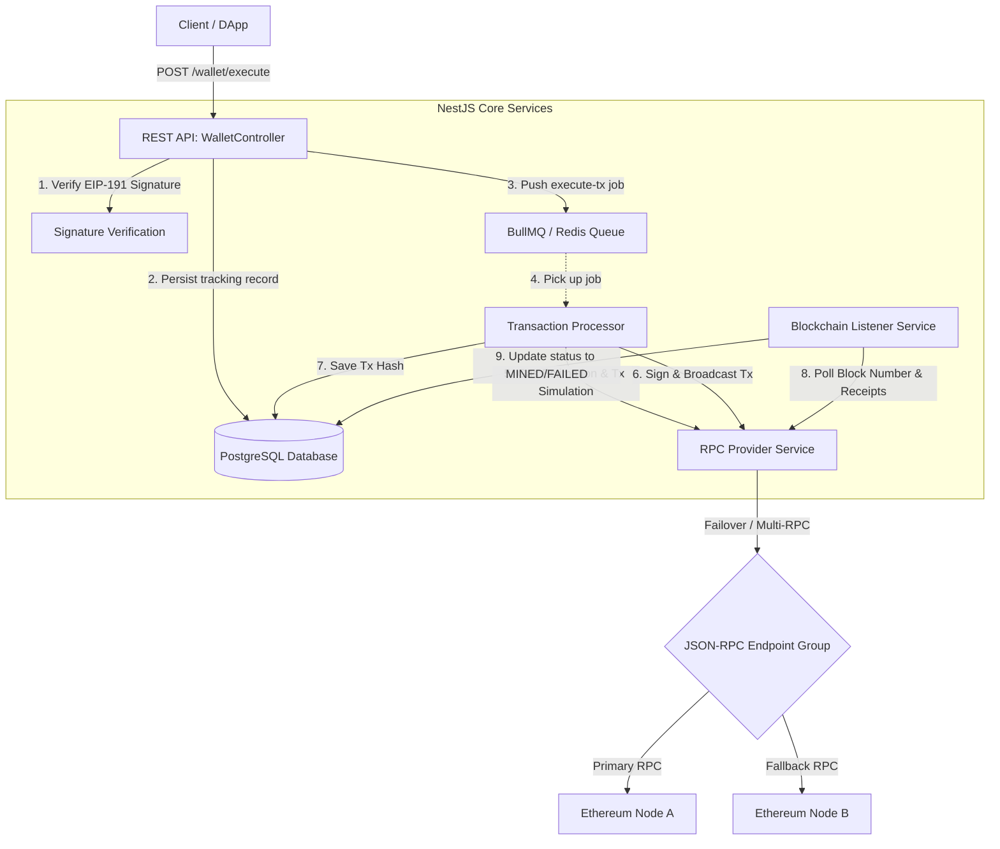

# Web3 Relayer MVP

A high-performance, resilient, and production-ready **Web3 Transaction Relayer** built with **NestJS**. This system acts as a relayer that receives transaction requests from clients, verifies cryptographic signatures, persists state, queues transactions for safe asynchronous broadcasting using BullMQ, and tracks blockchain confirmation status.

---

## 🏗️ Architecture Flow



---

## ⚡ Key Features

- **🔐 Cryptographic Signature Verification**: Protects endpoints by verifying that the signature matches the declared sender address (`ethers.verifyMessage`) using EIP-191 compatible string formats (`sender:target:data`).
- **🗃️ Robust Queuing System (BullMQ)**: Prevents transaction overlapping, handles network latency, and ensures high availability via Redis-backed queuing.
- **🔌 Multi-RPC Failover & Auto-Retry**: Built with RxJS streams. If the active JSON-RPC node fails, the service automatically rotates to fallback endpoints and retries the operation seamlessly.
- **⛽ Smart Gas Estimation**: Simulates transactions via `estimateGas` prior to broadcasting, preventing gas waste on invalid executions.
- **📡 Blockchain Confirmation Sync**: An internal block listener processes transactions, monitoring them until they are finalized on-chain and updating the database records to `MINED` or `FAILED`.
- **🧪 Modern Testing Suite**: Integrates **Testcontainers** for fully dockerized, isolated E2E tests running real Postgres and Redis instances.

---

## ⚙️ Project Configuration

Before starting, copy `.env.example` to `.env` and fill in your values:

```bash
cp .env.example .env
```

| Environment Variable | Description | Default |
|---|---|---|
| `NODE_ENV` | Application environment (`development`, `production`, `test`) | `development` |
| `PORT` | HTTP Server port | `3000` |
| `DB_HOST` | PostgreSQL Hostname | `localhost` |
| `DB_PORT` | PostgreSQL Port | `5432` |
| `DB_USERNAME` | PostgreSQL Username | - |
| `DB_PASSWORD` | PostgreSQL Password | - |
| `DB_NAME` | PostgreSQL Database name | - |
| `RELAYER_PRIVATE_KEY` | Hex private key of the Ethereum wallet funding transaction gas | - |
| `RPC_URLS` | Comma-separated list of JSON-RPC endpoint URLs for failover | - |
| `REDIS_HOST` | Redis Server Hostname | `localhost` |
| `REDIS_PORT` | Redis Server Port | `6379` |

---

## 🚀 Getting Started

### Prerequisites

- [Node.js](https://nodejs.org/) (v18 or higher recommended)
- [npm](https://www.npmjs.com/)
- [Docker](https://www.docker.com/) (Required for running integration tests via Testcontainers)
- A running instance of PostgreSQL and Redis (for local development)

### Installation

```bash
# Clone the repository and install dependencies
npm install
```

### Running the App

```bash
# Development (watch mode)
npm run start:dev

# Production build & run
npm run build
npm run start:prod
```

---

## 📡 API Reference

### Relayer Transaction Execution

Triggers transaction broadcasting. The message payload must be signed using the user's private key.

- **URL**: `/wallet/execute`
- **Method**: `POST`
- **Headers**: `Content-Type: application/json`
- **HTTP Response Code**: `202 Accepted`

#### Request Body
```json
{
  "sender": "0x90F8bf3254111440d99520C407556130C4e2ac50",
  "target": "0x5FbDB2315678afecb367f032d93F642f64180aa3",
  "data": "0xa9059cbb00000000000000000000000090f8bf3254111440d99520c407556130c4e2ac500000000000000000000000000000000000000000000000000000000000000064",
  "signature": "0x..."
}
```

#### Message Format for Signing
The signature must be generated by hashing the colon-concatenated string of `sender`, `target`, and `data` in the following format:
```text
sender:target:data
```
For example, sign the string:
`0x90F8bf3254111440d99520C407556130C4e2ac50:0x5FbDB2315678afecb367f032d93F642f64180aa3:0xa9059cbb00000000000000000000000090f8bf3254111440d99520c407556130c4e2ac500000000000000000000000000000000000000000000000000000000000000064`

#### Response Body
```json
{
  "trackingId": "b6a7a08b-59d4-406a-a249-f538e12a43fe",
  "status": "PENDING"
}
```

---

## 🧪 Testing

The repository contains isolated unit tests as well as E2E/integration tests.

```bash
# Run unit tests
npm run test

# Run E2E tests (Uses Testcontainers to spin up Postgres and Redis)
npm run test:e2e

# Run test coverage
npm run test:cov
```

*Note: Make sure Docker is running on your machine before triggering `npm run test:e2e`.*

---

## 📄 License

This project is unlicensed / proprietary.
